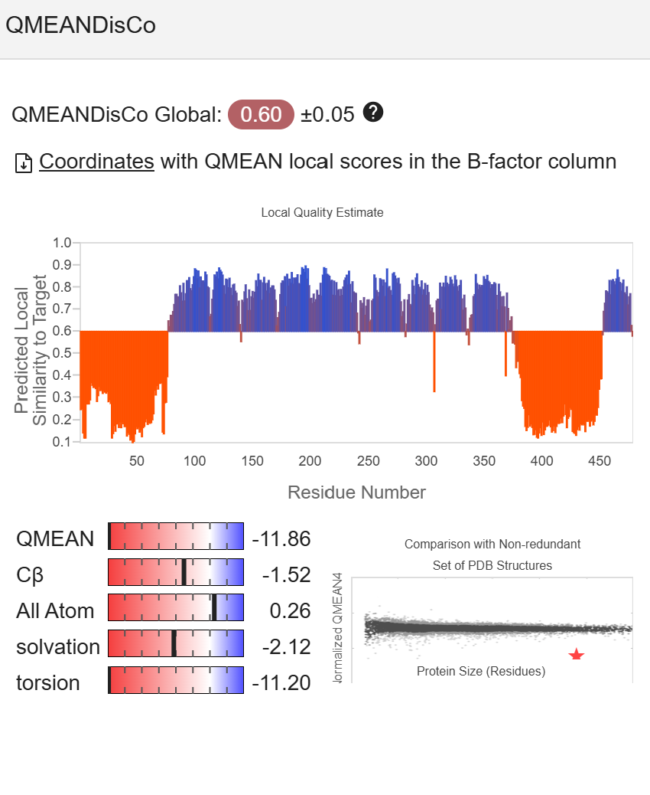
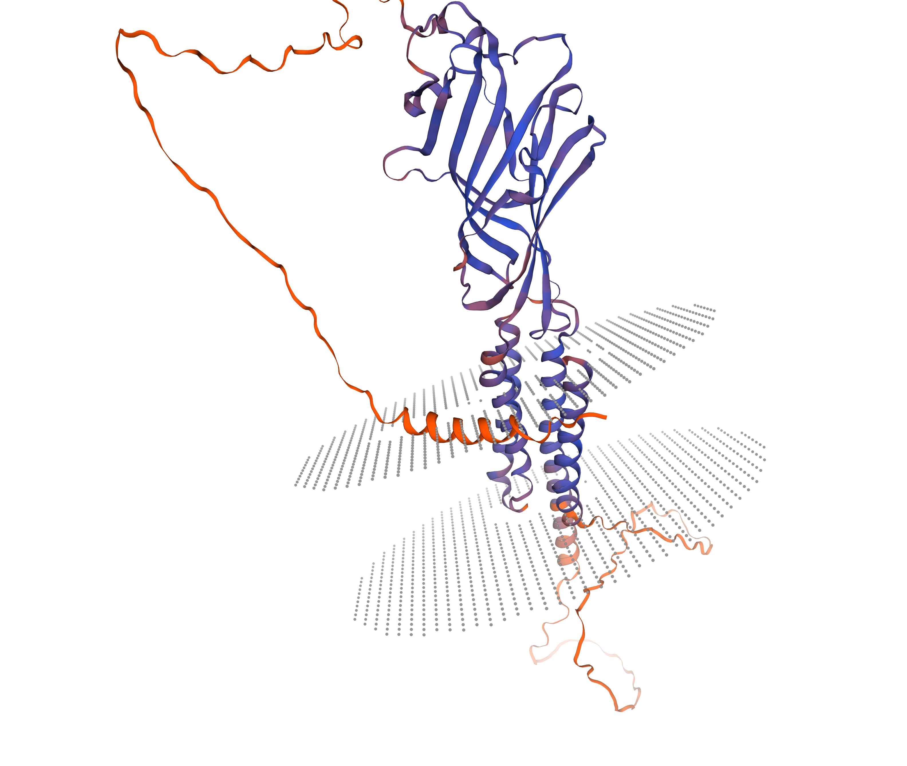

# Third Day: Tertiary Structure Prediction Analysis

## Swiss-Model Results

### MolProbity Score

The **MolProbity Score** is a combined protein quality score that reflects the crystallographic resolution at which such a quality would be expected. The goal is to have a score **as low as possible** as indicated by the documentation.

The **MolProbity Score** for the protein pdb tested was of: 3.37, indicating a average quality but not as good as it could be, a better score is considered below 2.0

### QMEAN

**QMEAN** is a composite estimator based on different geometrical properties and provides both global and local absolute quality estimates on the basis of one single model. It ranges from a value of **0-1**, where closer to **1** is better.

The **QMEAN Global Score** was: 0.6, matching with the last result is not an excellent score but rather a average one, meaning a average geometry quality of the protein 

### Ramachandran Plot

Ideally, points should "fall" into the zones of the Ramachandran plot considered correct for good folding. In this case, there are **outliers** that do not meet this criteria.

The **Ramachandran Plot** shows that most of the residues are inside the expected $\phi$ and $\psi$ angles, but as shown in orange dots, some of them are qualified as outliers

### Sequence Features

Despite previous indicators suggesting a suboptimal modeled structure, it successfully identified the **GABA receptor protein**, which is the source of the raw amino acid sequence.

### Structure Quality

The image shows good quality in the **core** of the structure (blue), but quality decreases at the **C- and N-terminal ends** (orange), those that match with the residues identified by the Ramachandran Plot.

## SAVES Results

**SAVES** is an other tool for quality control of protein structure, giving us results that are calculated by others algorithms different from the *swiss model*, allowing us to compare different approaches´.

For the **SAVES** analysis, **ERRAT** and **VERIFY 3D** programs were used.
*   **VERIFY 3D**: It was found that less than **80%** of the amino acids had a score >= 0.1 in the 3D/1D profile.

*   **ERRAT**: Calculated a quality of **71.12%**.
