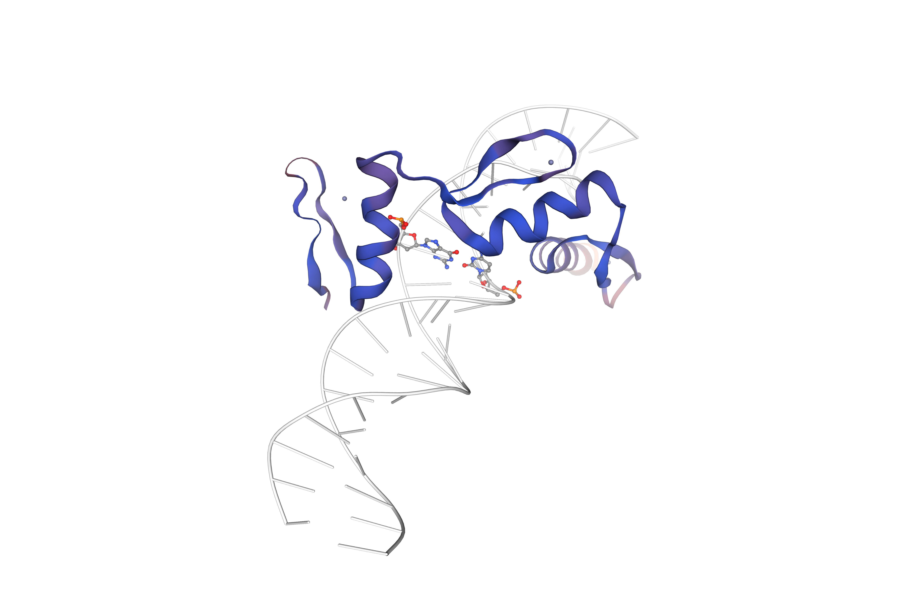

# Third Day: Tertiary Structure Prediction Analysis

## Swiss-Model Results

### Rationale for the Trimmed Sequence
The trimmed sequence (residues 335-423) was used for the analysis because the available experimental crystal structures of EGR1 in the PDB only cover this specific DNA-binding domain. Trimming the sequence allowed for an "apples-to-apples" comparison against the known structural template, avoiding the high noise levels associated with the disordered N- and C-terminal regions of the full-length protein.

*Crystal Structure from PDB (x-ray)[reference for the predictions]*

### MolProbity Score
**Full Sequence:**

**Trimmed Sequence:**

The **MolProbity Score** is a combined protein quality score that reflects the crystallographic resolution at which such a quality would be expected. The goal is to have a score **as low as possible**.

The analysis compares two models:
1. **Full Sequence:** The score was **2.59**, indicating an average quality.
2. **Trimmed Sequence:** The score improved significantly to **1.96**. A score below 2.0 is generally considered good, suggesting the trimmed model is crystallographically more plausible.

### QMEAN
**Full Sequence:**

**Trimmed Sequence:**

**QMEAN** is a composite estimator based on different geometrical properties. It ranges from **0-1**, where closer to **1** is better.

*   **Full Sequence:** The **QMEAN Global Score** was **0.33**, which is quite low. However, the local quality plot reveals why: the majority of the protein (residues 1-300 and 420+) is modeled with very low confidence (orange), while a specific region (residues ~330-420) shows high similarity to the target (blue/purple).
*   **Trimmed Sequence:** The **QMEAN Global Score** was **0.79**, a much better result. The local quality plot shows consistently high confidence across the entire modeled chain, indicating this model represents a stable, well-folded domain.

### Ramachandran Plot
**Full Sequence:**

**Trimmed Sequence:**

Ideally, points should "fall" into the green zones of the Ramachandran plot, which represent energetically favored angles for amino acid residues.

*   **Full Sequence:** There is a significant number of **outliers** (orange/red dots) scattered outside the favored regions, consistent with the disordered nature of the full protein.
*   **Trimmed Sequence:** The plot is much cleaner, with the vast majority of residues clustered tightly within the favored (dark green) and allowed (light green) regions, indicating good stereochemical quality for the folded domain.

### Sequence Features
**Full Sequence:**

**Trimmed Sequence:**

The sequence features provide context on what was actually modeled.

*   **Full Sequence:** Identified as **Early growth response protein 1 (*Homo sapiens*)**. The bar is predominantly orange (disordered), explaining the poor global scores. Only the **Zinc finger** region (blue) is structured.
*   **Trimmed Sequence:** Identified as **Early growth response protein (*Thamnophis sirtalis*)**. This model focuses specifically on the structured domain, eliminating the disordered regions, which aligns with the high quality scores observed.

It's important to notice that the trimmed sequence comparison with the UniProt database shows an EGR (Early Growth Response Protein) from another organism that is not human. This caught my attention because the sequence was indeed of a human EGR1; in this comparison, the full sequence correctly matched the organism, whereas the trimmed sequence did not. 

### Structure Quality
**Full Sequence:**

**Trimmed Sequence:**

The structural visualization confirms the numerical data.

*   **Full Sequence:** The image shows a small, well-folded core (blue/purple) binding to DNA, surrounded by large, unstructured loops (orange). These "spaghetti-like" regions correspond to the low-quality scores in the QMEAN plot.
*   **Trimmed Sequence:** The structure is compact and well-defined (mostly blue), representing the **Zinc Finger domain** interacting with the DNA helix. The absence of the long disordered tails results in a much higher quality model.

In both structures, the presence of three $\text{Zn}^{2+}$ ions is shown, but they are more clearly visible in the trimmed sequence (blue dots). 

-------------------------------------------------------------------------------
For this example, the use of the SAVES tools was not possible due to format limitations. The SAVES tools work with the `.pdb` format, but the current standard is the `.cif` format, which is the only output format for AF3. Consequently, the quality check was performed using MolProbity, which is integrated into the SWISS-MODEL tool.